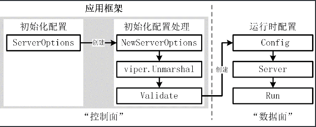

## miniblog 项目

miniblog 项目使用 pflag、viper、cobra 三个强大的 Go 包来构建应用的命令行选项、
配置文件和应用启动框架。为了能够在未来承载更多的应用功能、应用配置，并且确保应用代
码的可读性、可维护性和可扩展性，miniblog 项目参考 Kubernetes 的应用构建方式，设
计了 miniblog 项目的应用构建模型，如图所示。



在 miniblog 的应用构建模型中，有两大类配置：初始化配置和运行时配置。

初始化配置，是在程序启动时，通过命令行选项、环境变量或配置文件设置的配置。这类配置受
限于配置方式，可能会缺少应用运行时需要的配置，例如 MySQL 客户端连接实例、第三方微服
务客户端连接实例等配置（不可能通过命令行选项传递一个 MySQL 客户端连接实例）。这些连
接实例，一般会基于初始化配置来创建或初始化。因此，在 miniblog 应用构建模型中，还有
一个运行时配置。运行时配置包含了服务运行时依赖的配置。

初始化配置可能有很多配置项，并不是所有的配置项在程序启动时都需要设置，这类配置项一般
可通过默认值来设置。所以在程序启动时，会通过 NewServerOptions 函数来创建一个带有
默认值的初始化配置项变量。之后，通过命令行选项、环境变量、配置文件等方式来覆盖变量中
指定的配置项，从而达到仅设置必要的配置项即可运行程序的目的，以此简化应用启动时的配置。

在 miniblog 应用构建模型中，还有一个步骤 viper.Unmarshal，这一步操作可以将 viper 
读取的配置文件中的配置项保存在初始化配置变量中，从而用配置文件中的配置项覆盖默认的配置项。

此外，为了确保初始化配置可用，还需要对初始化配置进行校验，然后基于初始化配置创建一个运行
时配置 Config。之后，便可以使用运行时配置 Config 来创建一个服务实例，并调用服务实例的 
Run 方法，启动服务。

为了提高程序的稳定性和可维护性，miniblog 将初始化配置、应用框架构建部分代码保存在 
cmd/mb-apiserver/app 目录下。将运行时配置及运行时代码保存在 internal/apiserver 
目录中。从而达到类似于软件架构中“控制面”和“数据面”分开的效果。

在应用规模小、配置简单的情况下，初始化配置和运行时配置一般能保持一致。但是当应用规模变
大时，使用运行时配置，专门管理程序运行时的配置项，会大大降低应用代码的维护复杂度。

### 构建 miniblog 应用框架

miniblog 使用 cobra 来构建 Go 应用框架。使用 cobra 框架，需要创建 cobra.Command 
类型的对象。为了保证 main 文件代码清晰易读，需要将创建 cobra.Command 类型对象的代码
保存到 cmd/mb-apiserver/app/server.go 文件中。

你可以根据需要重命名 server.go 文件名，例如，将其重命名为 app.go、miniblog.go 等名
称。关于文件命名，根据我的开发经验，我有以下建议：如果没有特殊命名需要，可以考虑将文件名
命名为项目无关的名称，例如 server.go。这样就可以在所有同类项目中，保持文件名一致，从而
减轻再理解成本。另外，如果你想复制该项目，并魔改为一个新项目，这类项目无关的命名方式，可
以减轻新项目，重新命名文件名的工作量。

将 main 入口放在 cmd/mb-apiserver/main.go 目录中，将具体的代码实现放在 
cmd/mb-apiserver/app/目录下，可以确保 main 入口函数简单，利于 main 函数的定位。另外，
确保 main 函数简单、独立，可以支持使用以下命令来便捷的安装应用：

```bash
go install github.com/maloong2022/miniblog/cmd/mb-apiserver
```

如果 cmd/mb-apiserver 包含了不可导出的函数、变量或其他标识符，在执行上述命令安装应用时
会报错。

在 main 文件中，通过导入匿名包 _ "go.uber.org/automaxprocs"，用来在程序启动时自动设
置 GOMAXPROCS 配置，使其与 Linux 容器的 CPU 配额相匹配。通过正确设置容器的 CPU 配额，
可以解决 GOMAXPROCS 可能设置过大，导致生成线程过多，从而导致严重的上下文切换，浪费 CPU，
降低程序性能的潜在问题。

cmd/mb-apiserver/app/server.go 文件，在该文件中实现创建 *cobra.Command 实例的函数，
通过 NewMiniBlogCommand 函数初始化并创建了一个 *cobra.Command 对象，在创建该对象时，
指定了以下应用信息和设置：命令的名字、命令的简短描述、命令的详细描述、设置命令出错时不打印帮
助信息、指定调用 cmd.Execute() 时执行的 RunE 函数、设置命令运行时不需要指定命令行参数的
校验函数。

在 Go 应用开发中，使用配置最便捷的方式是将应用配置项都定义在一个配置项结构体中。通过将配置项
定义在配置项结构体中，不仅方便在程序中使用这些配置项，还可以统一管理这些配置项，降低程序维护的
成本。所以，在 miniblog 项目的应用构建模型中，会在 cmd/mb-apiserver/app/options 目录中
存放跟配置项相关的代码，例如：创建默认的配置项、配置项校验、配置项绑定命令行选项等。通过目录级
别的隔离，可以提高代码的可维护性。

定义应用配置项结构体类型之后，还需要提供一种途径来给配置项结构体中各个字段设置期望的值。在 Go 
项目开发中，有三种方式，来给这些配置项设置值：创建默认的配置项、通过命令行选项设置配置项、通过
配置文件设置配置项。

#### 创建默认的配置项

可以通过类似 NewServerOptions 这样的函数，来创建具有默认值的配置项结构体变量。设置具有默认值
的配置项能够显著提升程序的可用性和稳定性。通过提供合理的初始设置，程序即使在未提供配置或配置文件
丢失的情况下仍能正常运行，避免因缺少配置而导致的异常。同时，默认值降低了配置输入的依赖，使程序可
以快速启动，尤其适用于开发、调试和测试阶段，可以大幅提高开发效率。

默认值不仅为开发者和运维人员提供了参考，有助于理解和管理配置项，还允许用户通过环境变量、命令行选
项或配置文件灵活覆盖默认值。而且，默认值通常反映最常见或推荐的设置，能够作为文档说明的重要补充，
从而提升配置的可读性，使应用更易操作和维护。

#### 通过命令行选项设置配置项

除了可以创建带默认值的配置项结构体变量来配置应用外，还可以通过命令行选项来配置应用。使用命令行选
项配置应用，可以带来以下好处：

1. 零成本获知应用程序的配置项：只需要执行 mb-apiserver -h 就能够知道 mb-apiserver 命令有哪
些配置项，以及配置项的说明和默认值；
2. 可快速启动程序：如果应用程序配置项比较少，可以不用编写配置文件，仅通过指定命令行选项即可快速启
动程序，例如：_output/mb-apiserver --server-mode=gin；
3. 维护成本低：不需要维护额外的配置文件，仅限于参数很少的情况下；
4. 可以通过 Shell 脚本灵活配置应用：可以通过 Shell 脚本灵活指定应用启动时的各项命令行选项，例如
_output/mb-apiserver --server-mode=${server_mode}。

在实际的 Go 应用开发中，可以通过将配置项绑定到某个命令行选项，从而通过命令行选项来设置配置项的值，
进而在程序中使用这些配置项。例如： cmd/mb-apiserver/app/options/options.go 中 AddFlags 
方法。将命令行选项 --server-mode、--jwt-key、--expiration 分别绑定到 ServerOptions 结构体
中的 ServerMode、JWTKey、Expiration 字段。从而支持通过命令行选项来给 ServerOptions 结构体中
绑定的字段设置期望的值，例如：
```bash
_output/mb-apiserver --expiration=4h
```

在 Go 应用启动时，可以直接通过命令行选项来设置配置项的值，这种方式最大的优点是便捷。但当配置项太多时，
如果都通过命令行选项来设置，会使应用启动参数很长，不便于维护，反而会增加运维复杂度。所以，miniblog 
项目仅使用命令行选项来设置核心的配置项，其他配置项通过更易维护的配置文件来设置。例如：

```bash
_output/mb-apiserver -h

...
Usage:
  mb-apiserver [flags]

Flags:
  -c, --config string         Path to the miniblog configuration file. (default "/Users/andying/.miniblog/mb-apiserver.yaml")
      --expiration duration   The expiration duration of JWT tokens. (default 2h0m0s)
  -h, --help                  help for mb-apiserver
      --jwt-key string        JWT signing key. Must be at least 6 characters long. (default "Rtg8BPKNEf2mB4mgvKONGPZZQSaJWNLijxR42qRgq0iBb5")
      --server-mode string    Server mode, available options: [grpc grpc-gateway gin] (default "grpc-gateway")
```
Validate 方法用来验证 ServerOptions 中的配置项字段值是否合法。因为配置项有多个，在校验时，可能有
多个配置项不合法，所以代码中，使用了 error 类型的数组来保存这些错误，并通过 utilerrors 包将这些错
误聚合为一个错误并返回。utilerrors 是 Kubernetes 生态中的一个包，被大量使用，miniblog 项目这里
也是借鉴了 Kubernetes 项目中处理错误的方法。

Kubernetes 项目及其生态中有大量易用的 Go 包，在 Go 项目开发中，可以复用这些 Go 包以提高 Go 代码
开发的质量和效率。如果你想提高自己的 Go 开发技能，也建议你多阅读下 Kubernetes 项目的源码及其软件架
构方法。

#### 绑定命令行选项

在 cmd/mb-apiserver/app/options/options.go 文件中，定义了 ServerOptions 结构体类型，接下来还
需要将 ServerOptions 结构体中的特定字段绑定到 *cobra.Command 实例的全局标志集（FlagSet）中。绑定
方法很简单，只需要在 NewMiniBlogCommand 方法中添加以下代码即可
```go
opts.AddFlags(cmd.PersistentFlags())
```
调用 opts.AddFlags() 方法，将 ServerOptions 中选定的字段绑定到了 cmd.PersistentFlags() 标志集中。


#### 通过配置文件设置配置项

还可以通过结构化（例如 JSON 格式或 YAML 格式）的配置文件来配置应用。通过结构化的配置文件，开发者可以清 
晰的了解到应用的所有配置项，从而降低应用配置的维护成本。另外，配置文件也很适合在不同环境下分发。通过配置
文件来配置应用，可以带来以下好处：

1. 配置文件更易部署：可以将应用需要的所有配置，聚合在一个配置文件中，部署时，只需要部署、加载这个配置文件 
即可启动程序，不用配置一大堆命令行选项；
2. 配置文件更易维护：可以将应用需要的所有配置都保存在配置文件中，加上详细的配置说明，不需要的配置可以注释
掉。一个具有全量配置项、详细说明的配置文件，更易于理解。并且在修改时，只需要修改配置项的值，而不需要修改配
置项名称，更不易出错；
3. 配置文件可以实现热加载能力：应用程序监听配置文件的变更，有变更时重新加载程序配置，可以实现配置热加载能力；
4. 配置层次表达更清晰：命令行选项无法直接表达“层次”，但配置文件可以。层次化的配置表达，更易于理解。因为具
有“层次”，所以配置文件也可以表达更复杂的配置内容。

使用配置文件的方式很简单，只需要给应用添加 --config 命令行选项，在应用启动时，通过 --config 选项指定配置
文件，并在程序内将配置文件中的配置项解析到所绑定的配置项结构体字段即可。之后，程序中就可以通过配置项结构体变
量来访问这些配置项。

在cmd/mb-apiserver/app/server.go中通过 cmd.PersistentFlags()。StringVarP() 调用，给应用添加了 
--config/-c 命令行选项，用来指定配置文件的路径，并将配置文件路径保存在 configFile 变量中。configFile 
默认值由 filePath() 函数生成，默认值为$HOME/.miniblog/mb-apiserver.yaml。

通过 cobra.OnInitialize(onInitialize) 调用，可以确保程序运行时，会将 --config 命令行选项指定的配置
文件内容加载到 viper 中。通过 viper.Unmarshal(opts) 调用，将 viper 中的配置项解析到初始化配置变量 
opts 中。

在使用配置文件配置应用的时候，可以根据需要选择多种配置文件格式，例如：JSON、YAML、TOML、INI 等，这里建议
使用 YAML，理由如下：

1. YAML 语法简单、格式易读、程序易处理；
2. YAML 格式可以表达非常丰富、复杂的配置结构；
3. YAML 格式普适性高，新人零理解成本。

##### 添加并解析配置文件

cobra 支持通过 cobra.OnInitialize(y ...func()) 函数注册一个回调函数，该回调函数在每次运行任意命令时都
会被调用。可以借助该方法，来注册一个配置文件加载函数，在每次运行命令时，加载配置文件。
onInitialize 函数实现位于 cmd/mb-apiserver/app/config.go 文件中。

viper 包会优先从 configFile 中指定的配置文件中加载配置。如果 configFile 为空，则会加载默认的配置文件。
viper.AddConfigPath(dir) 用来指定默认配置文件的加载路径。配置文件加载路径通过 searchDirs() 函数返回。

viper.SetConfigType("yaml") 用来指定配置文件格式（YAML），viper.SetConfigName() 用来指定配置文件名。
最终，当 configFile 为空时，默认会从当前目录（.）和$HOME/.miniblog/ 目录下加载名为 mb-apiserver.yaml
的配置文件，并且以 YAML 格式处理配置文件。在设置了配置文件路径加载规则后，便可以使用 viper.ReadInConfig()
函数来读取配置文件。setupEnvironmentVariables() 函数用来配置环境变量读取规则，viper.AutomaticEnv() 用
来开启 viper 读取环境变量的功能。当多个服务同时在一台机器上运行时，可能会出现环境变量名称冲突，解决办法是给所
有的环境变量添加一个环境变量前缀，例如：MINIBLOGJWT_KEY，以此降低名称冲突的概率。可以通过 
viper.SetEnvPrefix("MINIBLOG") 来给所有的环境变量添加一个 MINIBLOG 前缀。
strings.NewReplacer("."， "-"， "_"， "-") 用来进行键名转换（例如将。替换成 ，将 - 替换成 ），确保环境
变量命名与配置键名兼容。

在 Go 应用开发中，通过给变量设置默认值是一个好的开发习惯，通过设置默认值，可以简化应用启动时的配置，规避配置缺
失时带来的程序异常。另外，在 onInitialize() 函数中，指定了默认加载的配置文件，通过这种设置默认值的方式，在开
发、测试时，可以直接运行二进制程序，程序自行查找默认的配置，省去了指定配置文件的操作，可以方便开发者开发测试。
但在生产环境，不建议使用这种不感知的配置加载方式，更建议明确指定加载的配置文件路径，例如：

```bash
_output/mb-apiserver -c $HOME/.miniblog/mb-apiserver.yaml

```

#### 更新配置文件内容

通过 cobra.OnInitialize(onInitialize) 函数调用，加载了配置文件。这时候，还需要将配置文件内容更新到 
ServerOptions 配置项变量中，供程序引用。
viper.Unmarshal 方法可以将 viper 中加载的配置项及值解析到 opts 变量的绑定字段中。opts.Validate() 
用来对配置项进行校验，确保初始化配置是合法可用的。

#### 读取配置内容

在添加完配置文件解析代码之后，便可以在代码中读取配置。有以下两种读取配置的方式：
在代码中建议使用更加显式的 opts.JWTKey 方式来引用配置项。viper.GetString 这种方式可以使用，但不建
议使用。因为引用感知度不强，可能会带来潜在的问题，例如传给 viper.GetString 的配置项名称不存在。

    提示：
    在 Go 项目开发中，要慎重使用感知度不强的开发方式，例如：使用 init() 方法、全局变量、隐式错误处理等。
    这些隐式的实现，很可能会因为开发者感知不到，而带来理解、维护成本，甚至带来程序缺陷。

viper 包提供了很多有用的函数，可以极大的方便我们读取 viper 中加载的配置。例如：
1. 使用 viper.AllSettings() 函数返回所有的配置内容； 
2. 使用 viper.Get(key) 获取指定 key 的配置值， 指的是配置项的数据类型。key 支持缩进形式，例如 mysql.username 
实际取的是 username 的值

### 基于初始化配置创建应用

根据 miniblog 应用构建模型，在确保初始化配置可以正确加载并读取之后，就可以基于初始化配置来创建运行时配置，
进而基于运行时配置创建出一个服务实例，并运行服务实例。

在开发中，推荐的风格是面向对象风格。相较于函数式风格，面向对象风格通过 UnionServer 结构体封装服务相关的功能，
便于扩展和维护，符合面向对象编程的思想，更适合复杂的大型项目。在面向对象风格中，如果服务的运行需要依赖某些属
性或配置（比如数据库连接、运行时状态等），可以将这些属性作为 UnionServer 结构体的字段，统一管理，逻辑更加清晰。
另外，面向对象风格的模块化设计，更有利于测试用例的编写。

miniblog 项目采用了面向对象风格。miniblog 运行时代码保存在 internal/apiserver 目录下，在该目录下创建 server.go 
文件。

代码，创建了运行时配置 Config，Config 结构体类型实现了 NewUnionServer() 方法，该方法可以用来创建 
UnionServer 类型的服务实例，UnionServer 实例的 Run 方法用来启动服务。

这里要注意，cmd/mb-apiserver/app/ 目录下的文件导入了 internal/apiserver 目录下的包，也就是“控制面”依赖“数据面”。
为了避免循环依赖，要避免反向导入。

在 cmd/mb-apiserver/app/server.go 文件中，添加以下代码来创建运行时配置，并基于运行时配置创建 UnionServer 服务实例，
并运行 UnionServer 服务实例的 Run 方法启动服务。

*cobra.Command 类型的 RunE 方法中，添加的代码逻辑越来越多，为了保持 cmd 功能的专一性：构建应用框架。这里将服务器启
动的代码逻辑单独放在了 run 方法中，便于管理。

### 给应用添加上版本号

应用发布后，经常会遇到以下两类问题：

1. 应用在生产环境中出现缺陷，需要查看代码进行排查，但无法确定线上应用具体使用的是哪个版本，尽管发布系统可能记录了应用的
发布版本，但服务器上的二进制文件可能已被替换；

2. 用户希望升级应用，但不知道当前应用的版本号，无法判断是否需要进行升级。

针对上述问题，标准做法是为应用添加版本号功能，通过执行 -v/--version 参数，应用可以输出自身的版本号。需要注意的是，这里
的版本号应能够精确定位到具体的代码快照，例如对应的 Git 提交哈希值。

应用程序的版本号具有以下功能：

1. 对内，可以精准定位到构建的代码仓库快照，方便阅读代码并发现问题；

2. 对外，用户可以清楚地知道使用的是哪个版本的应用，便于功能定位、问题反馈和更新软件；

3. 版本号还可以向用户传递额外信息，例如帮助用户了解软件的开发阶段和版本状态。例如 v2.0.0 表示这是一个基于 v1.x.x 升级后的
版本，该版本经过 v1 版本的打磨，从功能和稳定性上都有较大提升。v1.0.0-alpha 表示应用当前处于内测阶段，功能尚不完善，且可能存在较多缺陷。

因此，为应用添加版本号是 Go 应用标准且必需的功能。在实际开发中，需要先确定好版本号规范，然后基于规范给应用添加版本号功能。应用的版本号
通常通过指定 -v/--version 命令行参数进行打印。

    提示：

    业界通常使用 -v/--version 命令行选项来输出版本信息，我们开发 Go 项目时，需要遵循业界常用的开发方式、使用习惯，以减少应用的理解成本。

### SemVer 版本号规范

业界有多种版本号规范，目前使用最广泛的是语义化版本号规范，简称 SemVer 版本号规范。SemVer 规范的格式为：[name]x.y.z-[state+buildmetadata]，
例如：v2.1.5、v1.2.3-alpha.1+001。每一部分的含义如表所示。


一个符合 SemVer 版本号规范的版本号。


在语义化版本规范中，不同的版本号格式代表着软件所处的不同阶段及其稳定性，例如：0.Y.Z 表示当前软件处于研发阶段，软件并不稳定，1.0.0 表示当前
软件为初始的稳定版。

### 如何添加版本号？

在实际开发中，当完成一个应用特性开发后，会编译应用源码并发布到生产环境。为了定位问题或出于安全考虑（确认发布的是正确的版本），开发者通常需
要了解当前应用的版本信息以及一些编译时的详细信息，例如编译时使用的 Go 版本、Git 目录是否干净，以及基于哪个 Git 提交 ID 进行的编译。在一个编
译好的可执行程序中，通常可以通过类似。/appname -v 的方式来获取版本信息。

我们可以将这些信息写入版本号配置文件中，程序运行时从版本号配置文件中读取并显示。然而，在程序部署时，除了二进制文件外还需要额外的版本号配置
文件，这种方式既不方便，又面临版本号配置文件被篡改的风险。另一种方式是将这些信息直接写入代码中，这样无需额外的版本号配置文件，但每次编译时
都需要修改代码以更新版本号，这种实现方式同样不够优雅。

Go 官方提供了一种更优的方式：通过编译时指定 -ldflags -X importpath.name=value 参数，来为程序自动注入版本信息。

    提示：

    在实际开发中，绝大多数情况是使用 Git 进行源码版本管理，因此 miniblog 的版本功能也基于 Git 实现。


### 如何实现 Go 应用版本功能

go build -ldflags="-X main.Version=v1.0.0" 的具体操作含义：编译时通过指定 -ldflags 选项，将 v1.0.0 的值赋给 main 包中的 Version 变量。
之后，程序通过打印 Version 变量的值，即可输出版本号 v1.0.0。

-ldflags 命令行选项用来将指定的参数传递给 Go 的链接器，格式为：-ldflags '[pattern=]arg list'，例如：-X importpath.name=value。运行 
go tool link -h 可以查看链接器的使用帮助。

-X importpath.name=value 告诉 Go 链接器将 value 赋值给 importpath 包中的 name 变量。需要注意，name 必须是 string 类型的变量，否则编
译器会报以下错误。

### 给 miniblog 添加版本功能

可以通过以下步骤为 miniblog 添加版本功能：
1. 创建一个 version 包用于保存版本信息；
2. 将版本信息注入到 version 包中；
3. miniblog 应用添加 --version 命令行选项。

#### 创建一个 version 包

version 包用于记录版本号信息，而版本号功能几乎是所有 Go 应用都会用到的通用功能。因此，需要考虑将 version 包提供给其他外部应用程序使用。
根据目录规范，应将 version 包放在 pkg/ 目录下，以便其他项目可以导入并使用 version 包。由于 version 包需要是面向第三方应用的包，因此需
确保 version 包的功能稳定、完善，并能够独立对外提供预期的功能。

代码定义了一个 Info 结构体，用于统一保存版本信息。Info 结构体记录了较为详细的构建信息，包括 Git 版本号、Git 提交 ID、Git 仓库状态、应
用构建时间、Go 版本、用到的编译器和构建平台。

此外，Info 结构体还实现了以下方法，用于展示不同格式的版本信息：

1. Get 方法：返回详尽的代码库版本信息；
2. String 方法：以更友好、可读的格式展示构建信息；
3. ToJSON 方法：以 JSON 格式输出版本信息；
4. Text 方法：展示格式化的版本信息。

#### 将版本信息注入到 version 包中

接下来，可以通过 -ldflags -X "importpath.name=value" 构建参数将版本信息注入到 version 包中。

由于 miniblog 应用是通过 Makefile 进行构建的，因此需要在 Makefile 中实现版本信息和构建参数的配置。具体来说，需要将以下代码添加到 
Makefile 文件中。

使用 git describe --tags --always --match='v*'命令获取版本号。使用date -u +'%Y-%m-%dT%H:%M:%SZ'获取
命令构建时间。使用 git rev-parse HEAD获取构建时的提交 ID。

git describe --tags --always --match='v*'命令的参数说明如下：
* --tags: 使用所有标签，而不是仅仅使用带注释的标签（annotated tag）。示例如下：
    * git tag <tagname>: 生成一个不带注释的标签
    * git tag -a <tagname> -m '<message>': 生成一个带注释的标签
* --always: 如果仓库中没有可用的标签，则使用提交 ID 的缩写作为代替；
* --match <pattern>:只考虑与指定模式匹配的标签。例如：--match='v*'会匹配以“v”开头的标签。

假设仓库中存在以下提交记录和标签：

    * 8e27d05 (HEAD -> main) Latest commit
    * f9d2cef (tag: v1.2.3) Feature update
    * b43a1c7 (tag: v1.2.2) Bug fix
    * 1a4f9c8 (tag: v1.2.1) Minor update

执行以下命令获取标签：

```bash
git describe --tags --always --match='v*'
```

如果当前 HEAD 指向 main 分支，但没有直接打标签，则结果为：

    v1.2.3-1-g8e27d05

版本号v1.2.3-1-g8e27d05具体说明如下：
* 1.2.3： 最近的匹配标签
* -1：当前提交距离最近标签（v1.2.3）有 1 次提交
* g8e27d05：当前提交的缩写哈希值

如果当前分支没有匹配的标签（如果没有以“v“开头的标签），则结果为g8e27d05
上述 Makefile 通过 -ldflags 编译参数，向 version 包注入了 gitVersion、
gitCommit、gitTreeState、buildDate。Info 结构体中的另外三个编译信息 GoVersion、
Compiler、Platform 则可以使用 runtime 包来动态获取。

```go
func Get() Info {
	return Info{
		GitVersion:   gitVersion,
		GitCommit:    gitCommit,
		GitTreeState: gitTreeState,
		BuildDate:    buildDate,
		GoVersion:    runtime.Version(),
		Compiler:     runtime.Compiler,
		Platform:     fmt.Sprintf("%s/%s", runtime.GOOS, runtime.GOARCH),
	}
}
```

最后，还需要将 -ldflags 参数名及其值追加到 go build 命令行选项中。修改 Makefile
脚本中 build 规则，修改后的 build 规则如下：

```makefile

.PHONY: build
build: tidy #编译源码，依赖 tidy 目标自动添加/移除依赖包
		@go build -v -ldflags "$(GO_LDFLAGS)" -o $(OUTPUT_DIR)/mb-apiserver $(PROJ_ROOT_DIR)/cmd/mb-apiserver/main.go
```

#### miniblog 应用添加 --version 命令行选项

通过前面的步骤，在编译 miniblog 之后，所需的版本信息已成功注入 version 包中。接下来，还需要在 miniblog 主程序中调用
version 包打印版本信息。编辑 cmd/mb-apiserver/app/server.go 文件。
version.AddFlags(cmd.PersistentFlags()) 用来给 mb-apiserver 命令添加 -v/--version 命令行选项。version.PrintAndExitIfRequested() 
用来指定当 mb-apiserver 命令执行并传入 -v 命令行选项时，应用会打印版本号信息并退出。

---

### 开发日志包
在 Go 语言中，包是组织代码的一种基本方式，用于管理和复用代码。Go 提供了强大的包机制，
通过包可以将代码分成若干模块，以提高代码的可读性、可复用性和可维护性。在 Go 项目开发
中，经常会用到各种类型的包，其中有一些 Go 包会被频繁使用到，并且在 Go 项目开发中需要
进行适配。

高频使用的 Go 包有很多，例如：cobra、viper、pflag、gorm、gin、grpc、zap、logrus、uuid、
resty、casbin、jwt-go、validator、lru 等。上述常用的 Go 包，在项目开发中一般不需要做二
次适配便可直接使用。但是有些基础的 Go 包需要二次开发或者从零开发才能够满足 Go 项目的需
求。最常见的需要二次适配的 Go 包是日志包和错误包。

#### 如何记录日志
在开发日志包之前，需要先明白代码中，是如何记录日志的。之后，根据记录日志的需求特点开发
满足项目需要的日志包。记录日志通常涉及到以下几个方面：
1. 日志记录方式；
2. 日志记录规范；
3. 日志保存方式。


#### 日志记录方式

在 Go 项目开发中，通过日志包来记录日志。所以，在项目开发之前，需要准备一个易用、满足需求
的 Go 日志包。准备日志包的方式有以下三种：
1. 使用开源日志包：使用开源的日志包，例如 log、glog、logrus、zap 等。Docker、 ilium、Tyk 
等项目使用了 logrus，etcd 则使用了 log 和 zap；
2. 定制化开源日志包：基于开源日志包封装一个满足特定需求的日志包。例如，Kubernetes 使用的
klog 是基于 glog 开发的。有些项目封装的日志包还会兼容多种类别的 Logger；
3. 自研日志包：根据需求，从零开发一个日志包。

#### 使用开源日志包
如果对记录日志没有特殊需求，并且已经有优秀的开源日志包可供选择，那么直接使用原生的开源日志
包，无需封装或自行研发。这样不仅可以充分利用开源日志包的功能，还能随开源日志包进行功能升级
与迭代。最重要的是，这种方式能够显著提高开发效率，减少日志包维护的工作量。
然而，在以下情景下，可以考虑封装或自研一个新的日志包：

1. 需要满足定制化需求，而现有的开源日志包无法满足这些需求；
2. 拥有较强的研发能力，能够开发出在性能或功能上优于当前开源日志包的日志包；
3. 有定制化的日志记录需求。

目前已有许多开源日志包，社区比较受欢迎的开源日志包有 logrus、zap、zerolog、apex/log、log15 等。
其中最受欢迎的两个日志包是 logrus 和 zap。

logrus 功能强大、使用简单，不仅实现了日志包的基本功能，还有很多高级特性，适合一些大型项目，尤其
是需要结构化日志记录的项目。因为 logrus 封装了很多能力，性能一般。

zap 提供了很强大的日志功能，性能高，内存分配次数少，适合对日志性能要求很高的项目。另外，zap 包中
的子包 zapcore，提供了很多底层的日志接口，适合用来做二次封装。

在企业级 Go 应用开发时，通常会在 logrus、zap 二者之间进行选择，选择建议如下：
1. 如果对性能要求不高，更加注重日志包的功能和易用性，可以选择 logrus；
2. 如果对性能有较高要求，同时希望日志包更加灵活和可定制化，可以选择 zap。

miniblog 项目选择了 zap，因为 zap 具有较高的性能，同时使用便捷，并易于定制。实际上，zap 也可以作
为今后 Go 项目开发的首选日志包。

#### 定制化开源日志包
在实际开发中，基于开源日志包开发定制化日志包的主要原因在于，开源日志包无法完全满足特定需求。例如，
kubernetes 团队由于 glog 存在缺陷且已停止维护，基于 glog 重新开发了 klog。此外，一些团队需要在日
志中添加固定字段（如用户名、请求 ID 等），因此对开源日志包进行了改造；还有一些团队需要根据日志内
容触发回调逻辑，而这类需求通常难以通过现有的开源日志包实现，因此选择定制化开发。

在企业级应用开发过程中，出于多种需求，定制化开发新的日志包是一种常见的现象。然而，在决定开发新的
日志包之前，应当认真思考以下问题：是否确实需要开发一个新的日志包？现有的开源日志包是否完全无法满
足需求？


#### 自研日志包
如果前两种方式无法满足日志记录需求，可以考虑自主研发一个日志包。然而，自主研发日志包需要较高的研
发能力且开发周期较长，因此并不推荐，这里不作详细介绍。

### 日志记录规范
记录日志的方式实际上就是遵循项目制定的日志规范，通过调用日志包提供的方法来记录日志。
miniblog 也制定了相应的日志规范，具体规范内容见 docs/devel/zh-CN/conversions/logging.md。该日志
规范可以在后续的开发过程中根据需求不断更新和迭代。在 miniblog 的日志规范中，有以下两点规范需要注
意：

1. 错误日志应在最初发生错误的位置打印。这样做一方面可以避免上层代码缺失关键的日志信息（因为上层 
代码可能无法获取错误发生处的详细信息），另一方面可以减少日志漏打的情况（距离错误发生位置越远，越
容易忽略错误的存在，从而导致日志未被打印）；
2. 当调用第三方报函数或放发报错时，需要在错误处打印日志，例如：

```go
if err := os.Chdir("/root"); err != nil {
    log.Errorf("change dir failed: %v", err)
}
```

对于嵌套的 Error，可在 Error 产生的最初位置打印 Error 日志，上层如果不需要添加必要的信息，可以直
接返回下层的 Error。例如：

```go
package main

import (
  "flag"
  "fmt"
  "github.com/golang/glog"
)

func main() {
  flag.Parse()
  defer glog.Flush()

  if err := loadConfig(); err != nil {
    glog.Error(err)
  }
}

// 正例：直接返回错误
func loadConfig() error {
    return decodeConfig() // 直接返回
}

// 正例：如果需要基于函数返回的错误，封装更多的信息，可以封装返回的 err。否则，建议直接返回 err
func decodeConfig() error {
      if err := readConfig(); err != nil {
      // 添加必要的信息，用户名称
      return fmt.Errorf("could not decode configuration data for user %s: %v", "colin", err)
    }
    return nil
}

func readConfig() error {
    glog.Errorf("read: end of input.")
    return fmt.Errorf("read: end of input")
}
```

在最初产生错误的位置打印日志，可以很方便地追踪到错误产生的根源，并且错误日志只打印一次，
可以减少重复的日志打印，减少排障时重复日志干扰，也可以提高代码的简洁度。当然，在开发中
也可以根据需要对错误补充一些有用的信息，以记录错误产生的其他影响。


### 日志保存方式
我们可以将日志保存到任意需要的位置，常见的保存位置包括以下几种：
1. 标准输出：通常用于开发和测试阶段，主要目的是便于调试和查看；
2. 日志文件：这是生产环境中最常见的日志保存方式。保存的日志通常会被 Filebeat、Fluentd 等
日志采集组件收集，并存储到 Elasticsearch 等系统中；
3. 息中间件：例如 Kafka。日志包会调用 API 接口将日志保存到 Kafka 中。为了提高性能，通常会
使用异步任务队列异步保存。然而，在这种情况下，需要开发异步上报逻辑，且服务重启时可能导致
日志丢失，因此这种方式较少被采用。

当前比较受欢迎的日志包（如 zap、logrus 等）都支持将日志同时保存到多个位置。例如，miniblog 
项目的日志包底层封装了 zap，zap 支持同时将日志输出到标准输出和日志文件中。

如果应用采用容器化部署，建议优先将日志输出到标准输出。容器平台通常具备采集容器日志的能力，
采集日志时可以选择从标准输出采集或从容器内的日志文件中采集。如果选择从日志文件采集，则需
要配置日志采集路径；而如果选择从标准输出采集，则无需额外配置，可以直接复用容器平台现有的
能力，从而实现日志记录与日志采集的完全解耦。在 Kubernetes 最新的日志设计方案中，也建议应
用直接将日志输出到标准输出。

### miniblog 日志包开发
在 Go 项目开发中，通常会因为以下原因，选择从零开发一个日志包：
1. 为了方便通过日志进行问题排查，需要在每一行日志中打印一些自定义字段，例如请求 ID、用户名等。
虽然目前许多日志包（如 logrus、zap 等）都支持添加日志字段，但使用方式较为繁琐，且代码可读
性较差；
2. 随着项目功能的不断迭代，未来可能会出现特殊的日志需求。因此，开发一个定制的日志包可以为未来
的技术扩展做好准备，预留足够的扩展空间；
3. logrus、zap 等日志包功能丰富，但许多功能在项目开发中并不需要。因此，我考虑定制一个精简的日志包。
精简的日志包不仅易于使用，同时其有限的功能也有助于规范日志记录（日志包提供的日志记录函数数量直
接影响代码中日志记录方式的种类，功能过多可能导致难以实现规范化和统一化）。

### 日志包设计方式
在 Go 项目开发中，日志包实现方法有很多，但大都遵循以下设计方式：
1. 设计日志接口，通常命名为 Logger，日志接口中定义需要的日志方法；
2. 定义日志级别类型，并定义日志级别；
3. 定义日志结构体类型，例如：xxxLogger。xxxLogger 中包括需要的字段，例如日志级别。xxxLogger 通
常会实现一个打印日志的基础方法。Logger 接口中定义的方法，均通过调用基础方法实现日志打印。xxxLogger 
也可以包含其他日志包的日志实例，从而在输出日志时，调用其他日志包的方法进行输出；
4. 实现创建 xxxLogger 实例的 New 方法；
5. xxxLogger 结构体类型实现 Logger 接口中定义的方法。

```go
package main

import (
"fmt"
"strings"
)

// 定义日志级别
const (
  DebugLevel = iota
  InfoLevel
  WarnLevel
  ErrorLevel
)

// Logger 定义日志接口，包含常用日志方法.
type Logger interface {
  Debug(msg string)
  Info(msg string)
  Warn(msg string)
  Error(msg string)
}

// customLogger 是 Logger 接口的具体实现.
type customLogger struct {
  level int // 日志级别
  prefix string // 日志前缀
}

// New 创建一个 customLogger 实例.
func New(level int, prefix string) Logger {
    return &customLogger{level: level, prefix: prefix}
}

// logMessage 是内部方法，根据日志级别打印日志.
func (l *customLogger) logMessage(level int, levelStr string, msg string) {
  if level >= l.level { // 只有当日志级别大于等于设定的级别时才打印
    fmt.Printf("[%s] %s: %s\n", strings.ToUpper(levelStr), l.prefix, msg)
  }
}

// Debug 实现 Logger 接口的 Debug 方法.
func (l *customLogger) Debug(msg string) {
    l.logMessage(DebugLevel, "debug", msg)
}

// Info 实现 Logger 接口的 Info 方法.
func (l *customLogger) Info(msg string) {
    l.logMessage(InfoLevel, "info", msg)
}

// Warn 实现 Logger 接口的 Warn 方法.

func (l *customLogger) Warn(msg string) {
    l.logMessage(WarnLevel, "warn", msg)
}

// Error 实现 Logger 接口的 Error 方法.

func (l *customLogger) Error(msg string) {
    l.logMessage(ErrorLevel, "error", msg)
}

func main() {
  // 创建一个日志实例，日志级别为 Info
  logger := New(InfoLevel, "MyApp")
  // 根据不同级别打印日志
  logger.Debug("This is a debug message") // 不会打印（级别低于 Info）
  logger.Info("This is an info message") // 会打印
}
```

### miniblog 日志包开发

在定制开发日志包之前，应该先选择一个合适的开源日志包，并在其基础上进行封装。
miniblog 项目选择 zap 作为基础日志包。因此，在定制开发之前，需要熟悉 zap 的
使用方法，可参考相关的 zap 使用文档进行学习。

定制开发日志包的步骤如下：
（1）定义日志接口；
（2）定义日志类型；
（3）编写创建日志实例函数；
（4）实现日志实例化代码；
（5）实现日志接口。


#### 定义日志接口

在开发日志包之前，需要根据日志记录需要定义日志接口，接口中包含需要用到的日志
记录方法。在设计日志接口时，需要考虑以下两点：
1. 日志级别：在记录日志时，按严重性由低到高通常包括 Debug、Info、Warn、Error、
Panic、Fatal 级别。Warn 级别在有些日志包中也叫 Warning 级别；
   日志记录方法：每个日志级别，根据记录方式，又包括非格式化记录、格式化记录和
2. 结构化记录三种方式。形如 Info(msg string) 的方法为非格式化记录方式。形如 
Infof(format string, args ...any) 的方法为格式化记录方式。形如 Infow(msg string, 
kvs ...any) 的方法为结构化记录方式。Infow 方法名中的 w 代表“with”，即“带有”额外
的上下文信息。这些方法与没有 w 的方法（如 Debug，Info 等）相比，允许你在日志消息
后面附加额外的键值对（key-value），从而提供更详细的上下文信息。

iniblog 在设计时，为了满足项目不同日志级别的记录需求，实现了 Debug、Info、Warn、
Error、Panic、Fatal 级别的记录方法。

在 Go 项目开发中，建议的日志记录方式为结构化记录方式。格式化记录方式可以通过结
构化记录方式来替代，例如：log.Infof("Failed to create user: %s", username) 可替
换为 log.Infow("Failed to create user", "username", username)。

另外，结构化记录方式也可以替代非结构化记录方式，例如 log.Infof("Failed to create user") 
可替换为 log.Infow("Failed to create user")。

所以，miniblog 项目为了方便日志记录，降低开发者理解日志记录方法的负担，只实现了结构化
记录方法。最终 miniblog 日志接口定义（位于文件 internal/pkg/log/log.go 中）。

将日志包 log 放置在 internal/pkg 目录下的原因在于，日志包封装了一些定制化的逻辑，不适
合对外暴露，所以不适合放在 pkg/ 目录下。但是日志包又是项目内的共享包，所以需要放在 
internal/pkg 目录下。

通过定义 Logger 接口，可以体现接口即规范的编程哲学。这意味着，通过 Logger 接口可以清晰
地表明 zapLogger 需要实现哪些方法，并明确日志调用者应调用哪些方法。在 Go 项目中，通常
将日志接口命名为 Logger。

#### 定义日志类型
在文件 internal/pkg/log/log.go 中，通过以下代码定义了一个日志类型：
```go
// zapLogger 是 Logger 接口的具体实现. 它底层封装了 zap.Logger.
type zapLogger struct {
    z *zap.Logger
}
```

将日志类型定义为不可导出的 zapLogger 类型是因为开发者在使用日志包时，不需要关注日志具体
的实现细节，只需要调用日志接口包含的方法即可。定义为不可导出的类型，有利于日志类型的封装
和维护，屏蔽实现细节。

zapLogger 日志类型包含了 zap.Logger 类型的字段 z，是因为 zapLogger 底层会调用 zap.Logger 
类型实例 z 提供的日志记录方法。

#### 编写创建日志实例函数
一个日志包通常包含两类 zapLogger 对象：一类是全局对象，另一类是局部对象。全局对象便于通
过类似 log.Infow() 的方式直接调用，而局部对象则方便传入不同参数以创建自定义的 Logger。
为了实现这一目标，通常需要实现以下两种函数：

```go
// New 根据提供的 Options 参数创建一个自定义的 zapLogger 对象.
// 如果 Options 参数为空，则会使用默认的 Options 配置.
New(opts Options) zapLogger

// Init 初始化全局的日志对象.
Init(opts *Options)
```

Init 函数通过调用 New 函数来创建 zapLogger 类型的实例，并将其赋值给类型为 zapLogger 的全
局变量 std。

New 和 Init 函数中的 Options 结构体类型包含了日志的配置项。在开发初期，可以将 Options 定
义为空结构体，其字段后面根据需要陆续添加。

此外，根据 Go 代码开发的最佳实践，建议给 Options 结构体添加一个 NewOptions() Options 函数，
用于创建带有默认值的 Options 对象。通过这种方式，简化创建日志实例时的配置。

有些代码实现中，会将 Options 命名为 LoggerOptions，建议直接使用简洁的 Options 作为名称。
因为通过 <包名.结构体名> 的调用方式，已经能够明确 Options 是一个日志配置结构体。

#### 实现日志实例化代码

实例化 zapLogger 类型的日志，其实就是实例化 zapLogger 类型中的各个字段。zapLogger 类型只包含
了 zap.Logger 类型的字段。所以，实例化 zapLogger 类型，其实就是实例化 zap.Logger 类型。

New 方法中包含了 *zap.Logger 类型实例的初始化方法。有以下开发技巧可供参考。
创建一个默认配置并根据需要修改指定字段，是一种良好的开发方式。例如：
```go
// 创建 encoder 配置，用于控制日志的输出格式
encoderConfig := zap.NewProductionEncoderConfig()
// 自定义 MessageKey 为 message，message 语义更明确
encoderConfig.MessageKey = "message"
// 自定义 TimeKey 为 timestamp，timestamp 语义更明确
encoderConfig.TimeKey = "timestamp"
```
为了便于编译查找和分类管理，miniblog 将 Options 的定义与创建单独放置在了 options.go 文件中，
以实现文件级别的功能代码隔离。

在 Go 项目开发过程中，应始终考虑如何使程序更易读、更易维护。例如，为了提升日志的可读性，上述
代码将 ts 修改为 timestamp，将 msg 修改为 message，并将时间格式从 1669314079.4161139 转换为 
2022-11-24 23:12:25.479。
由于 log 包对 zap 包进行了封装，因此在调用栈中需要跳过的调用深度应增加 2，即使用 zap.AddCallerSkip(2)。


#### 实现日志接口
New 方法会实例化并返回 zapLogger 类型的实例。接下来就可以给 zapLogger 结构体添加 Logger 接口中定义的
方法。zapLogger 结构体类型中包含了 zap.Logger 类型的实例 z。可以使用 z 实例中提供的各类日志方法来封装
需要的 Logger 方法。

```go
// Debugw 输出 debug 级别的日志.
func Debugw(msg string, kvs ...any) {
    std.Debugw(msg, kvs...)
}

func (l *zapLogger) Debugw(msg string, kvs ...any) {
    l.z.Sugar().Debugw(msg, kvs...)
}
```

func (l zapLogger) Debugw(msg string, kvs ...any) 方法调用了 zap.Logger 的 Sugar().Debugw() 方法，
用于以结构化方式输出 debug 级别的日志。
为了便于通过 log.Debugw() 输出日志，代码实现了一个包级别函数 Debugw。该函数通过调用zapLogger 
类型的全局变量 std 的 Debugw(msg string, kvs ...any) 方法，输出 debug 级别的日志。**这里要注意，Debugw 
函数内部应该直接调用 std.Debugw(msg, kvs...)，而非 std.z.Sugar().Debugw(msg, kvs...)，这样可以复用 
zapLogger 类型的 Debugw 方法现在以及未来可能的实现逻辑。**

同理，我们可以为 *zapLogger 实现 Logger 接口中定义的其他方法。

为了在编译阶段确保 *zapLogger 实现了 Logger 接口，可以在 log.go 文件中添加以下变量定义：
```go
var _ Logger = (*zapLogger)(nil)
```
通过上述变量赋值，如果 *zapLogger 未实现 Logger 接口，代码将在编译阶段报错。此类编程技巧在 Go 项目开发中
被广泛使用。

#### miniblog 日志包调用
在开发了基础的 log 包之后，可以使用 log 包在 miniblog 应用中打印日志。添加步骤包括日志包初始化和调用日志
包方法打印日志。

cmd/mb-apiserver/app/server.go中, 同时实现了 logOptions 函数，用来从配置文件中读取日志配置，并返回 *log.Options 
类型的实例。这里要注意只 有设置 了配置项时，才需要给 opts 变量的字段进行赋值，否则日志初始化时，可能会因为 设置
了不合法的零值造成日志初始化失败。

在 run 函数中，添加了 log.Init(logOptions()) 函数调用，用来在应用运行时，初始化日志实例，并在 miniblog 
应用退出时，调用 log.Sync() 将缓存中的日志写入磁盘中。

修改 internal/apiserver/server.go 文件，将其中的配置内容打印，替换成 log

---

### 错误返回设计和实现

除了要实现日志包，另一个需要实现的基础包是错误包。错误包在 Go 项目开发中主要用来返回错误或者打印错误。返回错误时，
既需在代码内返回错误，又需要将错误返回给用户。在设计和实现错误包的时候，需要考虑上述使用场景。

#### 错误返回方法
在 Go 项目开发中，错误的返回方式通常有以下两种：

1. 始终返回 HTTP 200 状态码，并在 HTTP 返回体中返回错误信息；
2. 返回 HTTP 400 状态码（Bad Request），并在 HTTP 返回体中返回错误信息。

#### 方式一：成功返回，返回体中返回错误信息
例如 Facebook API 的错误返回设计，始终返回 200 HTTP 状态码：
```json
{
    "error": {
        "message": "Syntax error "Field picture specified more than once. This is only possible before version 2.1" at character 23: id,name,picture,picture",
        "type": "OAuthException",
        "code": 2500,
        "fbtrace_id": "xxxxxxxxxxx"
    }
}
```

在上述错误返回的实现方式中，HTTP 状态码始终固定返回 200，仅需关注业务错误码，整体实现较为简单。然而，此方式存在一个明显的缺点：对于每一次 HTTP 请求，既需要检查 
HTTP 状态码以判断请求是否成功，还需要解析响应体以获取业务错误码，从而判断业务逻辑是否成功。理想情况下，我们期望客户端对成功的 HTTP 请求能够直接将响应体解析为需
要的 Go 结构体，并进行后续的业务逻辑处理，而不用再判断请求是否成功。

#### 方式二：失败返回，返回体中返回错误信息
Twitter API 的错误返回设计会根据错误类型返回对应的 HTTP 状态码，并在返回体中返回错误信息和自定义业务错误码。成功的业务请求则返回 200 HTTP 状态码。 例如：
```bash
HTTP/1.1 400 Bad Request
x-connection-hash: xxxxxxxxxxxxxxxxxxxxxxxxxxxxxxxxxxxxxx
set-cookie: guest_id=xxxxxxxxxxxxxxxxxxxxxxxxxxxxxxxxxxxx
Date: Thu, 01 Jun 2017 03:04:23 GMT
Content-Length: 62
x-response-time: 5
strict-transport-security: max-age=631138519
Connection: keep-alive
Content-Type: application/json; charset=utf-8
Server: tsa_b
{
    "errors": [
        {
            "code": 215,
            "message": "Bad Authentication data."
        }
    ]
}
```

方式二相比方式一，对于成功的请求不需要再次判错。然而，方式二还可以进一步优化：
整数格式的业务错误码 215 可读性较差，用户无法从 215 直接获取任何有意义的信息。
建议将其替换为语义化的字符串，例如：NotFound.PostNotFound。

Twitter API 返回的错误是一个数组，在实际开发获取错误时，需要先判断数组是否为空，
如不为空，再从数组中获取错误，开发复杂度较高。建议采用更简单的错误返回格式：
```json
{
    "code": "InvalidParameter.BadAuthenticationData",
    "message": "Bad Authentication data."
}
```
需要特别注意的是，message 字段会直接展示给外部用户，因此必须确保其内容不包含敏感
信息，例如数据库的 id 字段、内部组件的 IP 地址、用户名等信息。返回的错误信息中，
还可以根据需要返回更多字段，例如：错误指引文档 URL 等。

### miniblog 错误返回设计和实现

miniblog 项目错误返回格式采用了方式二，在接口失败时返回对应的 HTTP/gRPC 状态码，
并在返回体中返回具体的错误信息，例如：

```bash
HTTP/1.1 404 Not Found
...
{
    "code": "NotFound.UserNotFound",
    "message": "User not found."
}
```

在错误返回方式二中，需要返回一个业务错误码。返回业务错误码可以带来以下好处：
1. 快速定位问题：开发人员可以借助错误码迅速定位问题，并精确到具体的代码行。例如，
错误码可以直接指示问题的含义，同时通过工具（如 grep）轻松定位到错误码在代码中
的具体位置；
2. 便于排查问题：用户能够通过错误码判断接口失败的原因，并将错误码提供给开发人员，
以便快速定位问题并进行排查；
3. 承载丰富信息：错误码通常包含了详细的信息，例如错误的级别、所属错误类别以及具体
的错误描述。这些错误信息可以帮助用户和开发者快速定位问题；
4. 灵活定义：错误码由开发者根据需要灵活定义，不依赖和受限于第三方框架，例如 net/http 
和 google.golang.org/grpc；
5. 便于逻辑判断：在业务开发中，判断错误类别以执行对应的逻辑处理是一个常见需求。通过
自定义错误码，可以轻松实现。例如：
```go
import "errors"
import "path/to/errno"

if errors.Is(err, errno.InternalServerError) {

}
```

### 制定错误码规范
错误码是直接暴露给用户的，因此需要设计一个易读、易懂且规范化的错误码。在设计错误码时
可以根据实际需求自行设计，也可以参考其他优秀的设计方案。

一般来说，当调研某项技术实现时，建议优先参考各大公有云厂商的实现方式，例如腾讯云、
阿里云、华为云等。这些公有云厂商直接面向企业和个人，专注于技术本身，拥有强大的技术团队，
因此它们的设计与实现具有很高的参考价值。

经过调研，此处采用了腾讯云 API 3.0 的错误码设计规范，并将规范文档保存在项目的文档目录
中：docs/devel/zh-CN/conversions/error_code.md。

腾讯云采用了两级错误码设计。以下是两级错误码设计相较于简单错误码（如 215、InvalidParameter）
的优势：

1. 语义化：语义化的错误码可以通过名字直接反映错误的类型，便于快速理解错误；
2. 更加灵活：二级错误码的格式为<平台级.资源级>。其中，平台级错误码是固定值，用于指代某一类错误，
客户端可以利用该错误码进行通用错误处理。资源级错误码则用于更精确的错误定位。此外，服务端既可
根据需求自定义错误码，也可使用默认错误码。

miniblog 项目预定义了一些平台级错误码，如表所示。


错误类型 0 代表客户端错误，1 代表服务端错误，2 代表客户端错误/服务端错误，- 代表请求成功。

### miniblog 错误包设计

开发一个错误包，需要先为错误包起一个易读、易理解的包名。在 Go 项目开发中，如果自定义包的名称如 
errors、context 等，会与 Go 标准库中已存在的 errors 或 context 包发生命名冲突，如果代码中需要同
时使用自定义包与标准库包时，通常会通过为标准库包起别名的方式解决。例如，可以通过 
import stderrors "errors" 来为标准库的 errors 包定义别名。

为了避免频繁使用这种起别名的操作，在开发自定义包时，可以从包命名上避免与标准库包名冲突。建议将可
能冲突的包命名为 <冲突包原始名>x，其名称中的“x”代表扩展（extended）或实验（experimental）。这种
命名方式是一种扩展命名约定，通常用于表示此包是对标准库中已有包功能的扩展或补充。需要注意的是，这
并非 Go 语言的官方规范，而是开发者为了防止命名冲突、增强语义所采用的命名方式。miniblog 项目的自定
义 contextx 包也采用了这种命名风格。

因此，为了避免与标准库的 errors 包命名冲突，miniblog 项目的错误包命名为 errorsx，寓意为“扩展的错
误处理包”。

由于 miniblog 项目的错误包命名为 errorsx，为保持命名一致性，定义了一个名为 ErrorX 的结构体，用于描
述错误信息，具体定义如下：

```go
type ErrorX struct {
    Code int json:"code,omitempty"
    Reason string json:"reason,omitempty"
    Message string json:"message,omitempty"
    Metadata map[string]string json:"metadata,omitempty"
}
```

ErrorX 是一个错误类型，因此需要实现 Error 方法：

```go
// Error 实现 error 接口中的 Error 方法.
func (err *ErrorX) Error() string {
    return fmt.Sprintf("error: code = %d reason = %s message = %s metadata = %v", err.Code, err.Reason, err.Message, err.Metadata)
}
```

Error() 返回的错误信息中，包含了 HTTP 状态码、错误发生的原因、错误信息和额外的错误元信息。通过这些详尽
的错误信息返回，帮助开发者快速定位错误。

在 Go 项目开发中，发生错误的原因有很多，大多数情况下，开发者希望将真实的错误信息返回给用户。因此，还需要提供一个方法用来设置 ErrorX 
结构体中的 Message 字段。同样的，还需要提供设置 Metadata 字段的方法。为了满足上述诉求，给 ErrorX 增加 WithMessage、WithMetadata、
KV 三个方法。
设置 Message、Metadata 字段的方法名分别为 WithMessage、WithMetadata。WithXXX，在 Go 项目开发中是一种很常见的命名方式，寓意是：设置 
XXX。KV 方法则以追加的方式给 Metadata 增加键值对。WithMessage、WithMetadata、KV 都返回了 *ErrorX 类型的实例，目的是为了实现链式调用，
例如：

```go
err := new(ErrorX)
err.WithMessage("Message").WithMetadata(map[string]string{"key":"value"})
```

在 Go 项目开发中，链式调用（chained method calls）是一种常见的设计模式，该模式通过在方法中返回对象自身，使多个方法调用可以连续进行。
链式调用的好处在于：简化代码、提高可读性、减少错误可能性和增强扩展性，尤其是在对象构造或逐步修改操作时，非常高效直观。合理使用链式
调用可以显著提升代码的质量和开发效率，同时让接口设计更加优雅。

errorsx 包的设计目标不仅适用于 HTTP 接口的错误返回，还适用于 gRPC 接口的错误返回。因此，ErrorX 结构体还实现了 GRPCStatus() 方法。
GRPCStatus() 方法的作用是将自定义错误类型 ErrorX 转换为 gRPC 的 status.Status 类型，用于生成 gRPC 标准化的错误返回信息（包括错误码、
错误消息及详细错误信息），从而满足 gRPC 框架的错误处理要求。GRPCStatus() 方法实现如下：

```go
func (err ErrorX) GRPCStatus() status.Status {
    details := errdetails.ErrorInfo{Reason: err.Reason, Metadata: err.Metadata}
    s, _ := status.New(httpstatus.ToGRPCCode(err.Code), err.Message).WithDetails(&details)
    return s
}
```

在 Go 项目开发中，通常需要将一个 error 类型的错误 err，解析为 ErrorX 类型，并获取 ErrorX 中的 Code 字段和 Reason 字段的值。Code 
字段可用来设置 HTTP 状态码，Reason 字段可用来判断错误类型。为此，errorsx 包实现了 FromError、Code、Reason 方法。

在 Go 项目开发中，经常还要对比一个 error 类型的错误 err 是否是某个预定义错误，因此 *ErrorX 也需要实现一个 Is 方法。

```go
func (err *ErrorX) Is(target error) bool {
    if errx := new(ErrorX); errors.As(target, &errx) {
        return errx.Code == err.Code && errx.Reason == err.Reason
    }
    return false
}
```

Is 方法中，通过对比 Code 和 Reason 字段，来判断 target 错误是否是指定的预定义错误。注意，Is 方法中，没有对比 Message 字段的值，
这是因为 Message 字段的值通常是动态的，而错误类型的定义不依赖于 Message。

### miniblog 错误码定义

在实现了 errorsx 错误包之后，便可以根据需要预定义项目需要的错误。这些错误，可以在代码中便捷的引用。通过直接引用预定义错误，不仅
可以提高开发效率，还可以保持整个项目的错误返回是一致的。

miniblog 的预定义错误定义在 internal/pkg/errno 目录下。

### miniblog 错误返回规范
为了标准化接口错误返回，提高接口错误返回的易读性，miniblog 制定了以下错误返回规范：
1. 所有接口都要返回 errorsx.ErrorX 类型的错误；
2. 建议在错误的原始位置，使用 errno.ErrXXX 方式返回 miniblog 自定义错误类型，其他位置直接透传自定义错误;


### miniblog 项目中实现的 Web 服务类型


miniblog 项目使用 Gin 框架实现了 HTTP 服务，使用 gRPC 框架实现了 gRPC 服务，使用 grpc-gateway 实现了 HTTP 反向代理服务，用来将 
HTTP 服务转换为 gRPC 服务。同时，miniblog 项目支持通过配置文件中的 tls.use-tls 配置项开启 TLS 认证。mb-apiserver 服务启动时，可
通过配置文件中的 server-mode 配置项来配置启动的 Web 服务类型：

1. server-mode=gin：启动使用 Gin Web 框架开发的 HTTP 服务；
2. server-mode=grpc：启动使用 grpc+grpc-gateway 框架开发的 gRPC 服务，同时支持 HTTP 请求。在 mb-apiserver 接收到 HTTP 请求后，HTTP 
反向代理服务，会将 HTTP 请求转换为 gRPC 请求，并转发给 gRPC 服务接口。

为什么 miniblog 项目会同时实现 HTTP 反向代理服务、gRPC 服务和 HTTP 服务：

1. HTTP 反向代理服务+gRPC 服务：在 Go 项目开发中，外部系统一般通过 HTTP 接口访问服务，而内部系统则基于性能和调用便捷性的考虑，
更倾向于使用 RPC 接口通信。一般情况下，服务只需要对外提供一种类型的通信协议。例如，仅提供 gRPC 接口，外部系统如果需要访问
可以访问 API 网关，请求在 API 网关层被转换为 gRPC 请求。但这种方式依赖于 API 网关基础设施，在企业应用开发中，有些服务因为
种种原因（例如，企业没有 API 网关），并不会接入 API 网关，所以这在这种情况下，服务内置一个 HTTP 反向代理服务器，用于支持 
HTTP 请求，并将请求自动转换为 gRPC 请求，以解决此类诉求。miniblog 服务的 HTTP 反向代理服务器+gRPC 服务的组合模式，既能满足
外部系统的访问需求，又能满足内部服务之间的访问需求；
2. HTTP 服务：绝大多数企业应用通过 HTTP 接口对外提供服务，这类 HTTP 服务通常使用 Gin 框架开发。本课程中的 HTTP 服务实现仅用于
展示如何使用 Gin 框架开发 HTTP 接口。

### RPC
miniblog 使用 gRPC 框架实现了一个 gRPC 服务器。使用 grpc-gateway 框架实现了一个 HTTP 反向代理服务器，用来将 HTTP 请求转化为 
gRPC 请求。

#### RPC 介绍

gRPC 是 RPC 协议的 Go 语言实现，因此在介绍 gRPC 之前，有必要先了解 RPC 协议的基本概念。

根据维基百科的定义，RPC（Remote Procedure Call，远程过程调用）是一种计算机通信协议。该协议允许运行在一台计算机上的程序调用
另一台计算机上的子程序，而开发者无需为这种交互编写额外的代码。

通俗来说，RPC 的核心思想是：服务端实现一个函数，客户端通过 RPC 框架提供的接口，可以像调用本地函数一样调用该函数，并获取返回
值。RPC 屏蔽了底层的网络通信细节，使开发人员无需关注网络编程的复杂性，从而能够将更多精力投入到业务逻辑的实现中，大幅提升开发
效率。


RPC 调用的具体流程如下：

1. 客户端通过本地调用的方式调用客户端存根（Client Stub）；
2. 客户端存根将参数打包（也称为 Marshalling）成一个消息，并发送该消息；
3. 客户端所在的操作系统（OS）将消息发送到服务端；
4. 服务端接收到消息后，将消息传递给服务端存根（Server Stub）；
5. 服务端存根将消息解包（也称为 Unmarshalling），得到参数；
6. 服务端存根调用服务端的子程序（函数），完成处理后，将结果按照相反的步骤返回给客户端。
需要注意的是，Stub 负责处理参数和返回值的序列化（Serialization）、参数的打包与解包，以及网络层的通信。在 RPC 中，客户端的 Stub 通
常被称为“Stub”，而服务端的 Stub 通常被称为“Skeleton”。


    提示：Stub 是存根（代理的意思）。

目前，业界有很多优秀的 RPC 协议，例如腾讯的 Tars、阿里的 Dubbo、微博的 Motan、Facebook 的 Thrift、RPCX 等。但使用最多的还是 gRPC。

### gRPC 介绍
gRPC 是由谷歌开发的一种高性能、开源且支持多种编程语言的通用 RPC 框架，基于 HTTP/2 协议开发，并默认采用 Protocol Buffers 作为数
据序列化协议。gRPC 具有以下特性：

1. 语言中立：支持多种编程语言，例如 Go、Java、C、C++、C#、Node.js、PHP、Python、Ruby 等；
2. 基于 IDL 定义服务：通过 IDL（Interface Definition Language）文件定义服务，并使用 proto3 工具生成指定语言的数据结构、服务端接
口以及客户端存根。这种方法能够解耦服务端和客户端，实现客户端与服务端的并行开发；
3. 基于 HTTP/2 协议：通信协议基于标准的 HTTP/2 设计，支持双向流、消息头压缩、单 TCP 的多路复用以及服务端推送等能力；
4. 支持 Protocol Buffer 序列化：Protocol Buffer（简称 Protobuf）是一种与语言无关的高性能序列化框架，可以减少网络传输流量，提高通
信效率。此外，Protobuf 语法简单且表达能力强，非常适合用于接口定义。


    提示：
    gRPC 的全称并非“golang Remote Procedure Call”，而是“google Remote Procedure Call”。   

与许多其他 RPC 框架类似，gRPC 也通过 IDL 语言来定义接口（包括接口名称、传入参数和返回参数等）。在服务端，gRPC 服务实现了预定义的接口。
在客户端，gRPC 存根提供了与服务端相同的方法。

### Protocol Buffers 介绍

Protocol Buffers（简称 Protobuf）是由谷歌开发的一种用于对数据结构进行序列化的方法，可用于数据通信协议、数据存储格式等，也是一种灵活且
高效的数据格式，与 XML 和 JSON 类似。由于 Protobuf 具有出色的传输性能，因此常被用于对数据传输性能要求较高的系统中。Protobuf 的主要特性
如下：

1. 更快的数据传输速度：Protobuf 在传输过程中会将数据序列化为二进制格式，相较于 XML 和 JSON 的文本传输格式，这种序列化方式能够显著减少 I/O 
操作，从而提升数据传输的速度；
2. 跨平台多语言支持：Protobuf 自带的编译工具 protoc 可以基于 Protobuf 定义文件生成多种语言的客户端或服务端代码，供程序直接调用，因此适用于
多语言需求的场景；
3. 良好的扩展性和兼容性：Protobuf 能够在不破坏或影响现有程序的基础上，更新已有的数据结构，提高系统的灵活性；
4. 基于 IDL 文件定义服务：通过 proto3 工具可以生成特定语言的数据结构、服务端和客户端接口。

在 gRPC 框架中，Protocol Buffers 主要有以下四个作用。
第一，可以用来定义数据结构。举个例子，下面的代码定义了一个 LoginRequest 数据结构：

```protobuf
message LoginRequest {
    string username = 1;
    string password = 2;
}
```

第二，可以用来定义服务接口。下面的代码定义了一个 MiniBlog 服务：

```protobuf
service MiniBlog {
  rpc Login(LoginRequest) returns (LoginResponse) {}
}
```

第三，可以通过 protobuf 序列化和反序列化，提升传输效率。
使用 XML 或 JSON 编译数据时，虽然数据文本格式可读性更高，但在进行数据交换时，设备需要耗费大量的 CPU 资源进行 I/O 操作，从而影响整体传
输速率。而 Protocol Buffers 不同于前者，它会将字符串序列化为二进制数据后再进行传输。这种二进制格式的字节数比 JSON 或 XML 少得多，因此
传输速率更高。

第四，Protobuf 是标准化的。我们可以基于标准的 Protobuf 文件生成多种编程语言的客户端、服务端代码。在 Go 项目开发中，可以基于这种标准化
的语言开发多种 protoc 编译插件，从而大大提高开发效率。

### miniblog 实现 gRPC 服务器

为了展示如何实现一个 gRPC 服务器，并展示如何通信，miniblog 模拟了一个场景：miniblog 配套一个运营系统，运营系统需要通过接口获取所有的用
户，进行注册用户统计。为了提高内部接口通信的性能，运营系统通过 gRPC 接口访问 miniblog 的 API 接口。为此，miniblog 需要实现一个 gRPC 服
务器。那么如何实现一个 gRPC 服务器呢？其实很简单，可以通过以下几步来实现：

1. 定义 gRPC 服务；
2. 生成客户端和服务器代码；
3. 实现 gRPC 服务端；
4. 实现 gRPC 客户端；
5. 测试 gRPC 服务。

#### （1）定义 gRPC 服务

我们需要编写.proto 格式的 Protobuf 文件来描述一个 gRPC 服务。服务内容包括以下部分：

1. 服务定义：描述服务包含的 API 接口；
2. 请求和返回参数的定义：服务定义了一系列 API 接口，每个 API 接口都需要指定请求参数和返回参数。

由于 gRPC 接口需要提供给外部用户调用，而调用过程依赖于 gRPC API 接口的请求参数和返回参数，因此我将 miniblog Protobuf 定义文件存放 
pkg/api/apiserver/v1/目录下。路径中的 v1 表示这是第一个版本的接口定义，给未来接口升级预留扩展能力。

```protobuf
syntax = "proto3";

package v1;
import "google/protobuf/empty.proto";
import "apiserver/v1/healthz.proto";

option go_package = "github.com/maloong2022/miniblog/pkg/api/apiserver/v1;v1";
service MiniBlog {
  rpc Healthz(google.protobuf.Empty) returns (HealthzResponse) {}
}
```

apiserver.proto 是一个 Protobuf 定义文件，定义了一个 MiniBlog 服务器。其首个非空、非注释的行必须注明 Protobuf 的版本。通过
syntax = "proto3" 可以指定当前使用的版本号，这里采用的是 proto3 版本。

package 关键字用于指定生成的 .pb.go 文件所属的包名。import 关键字用来导入其他 Protobuf 文件。option 关键字用于对 .proto 文
件进行配置，其中 go_package 是必需的配置项，其值必须设置为包的导入路径。

service 关键字用来定义一个 MiniBlog 服务，服务中包含了所有的 RPC 接口。在 MiniBlog 服务中，使用 rpc 关键字定义服务的 API 接
口。接口中包含了请求参数 google.protobuf.Empty 和返回参数 HealthzResponse。在上述 Protobuf 文件中，google.protobuf.Empty 是
谷歌提供的一个特殊的 Protobuf 消息类型，其作用是表示一个“空消息”。它来自于谷歌的 Protocol Buffers 标准库，定义在 
google/protobuf/empty.proto 文件中。


    提示：
    miniblog 项目依赖了一些 Protobuf 文件，为了降低读者学习的难度，miniblog 项目将依赖的 Protobuf 文件统一保存在 
    third_party/protobuf/ 目录下。

gRPC 支持定义四种类型的服务方法。上述示例中定义的是简单模式的服务方法，也是 miniblog 使用的 gRPC 模式。以下是四种服务方法的
具体介绍：

1. 简单模式（Simple RPC）：这是最基本的 gRPC 调用形式。客户端发起一个请求，服务端返回一个响应。定义格式为 
rpc SayHello (HelloRequest) returns (HelloReply) {}；
2. 服务端流模式（Server-side streaming RPC）：客户端发送一个请求，服务端返回数据流，客户端从流中依次读取数据直到流结束。定义格
式为 rpc SayHello (HelloRequest) returns (stream HelloReply) {}；
3. 客户端流模式（Client-side streaming RPC）：客户端以数据流的形式连续发送多条消息至服务端，服务端在处理完所有数据之后返回一次
响应。定义格式为 rpc SayHello (stream HelloRequest) returns (HelloReply) {}；
4. 双向数据流模式（Bidirectional streaming RPC）：客户端和服务端可以同时以数据流的方式向对方发送消息，实现实时交互。定义格式为
rpc SayHello (stream HelloRequest) returns (stream HelloReply) {}。

在 apiserver.proto 文件中，定义了 Healthz 接口，还需要为这些接口定义请求参数和返回参数。考虑到代码未来的可维护性，这里建议将不
同资源类型的请求参数定义保存在不同的文件中。在 Go 项目开发中，将不同资源类型相关的结构体定义和方法实现分别保存在不同的文件中，
是一个好的开发习惯，代码按资源分别保存在不同的文件中，可以提高代码的维护效率。

同样，为了提高代码的可维护性，建议接口的请求参数和返回参数都定义成固定的格式：

1. 请求参数格式：<接口名>Request，例如 LoginRequest；
2. 返回参数格式：<接口名>Response，例如 LoginResponse。

根据上面的可维护性要求，新建 pkg/api/apiserver/v1/healthz.proto 文件，在文件中定义健康检查相关的请求参数，内容如下：

```protobuf
syntax = "proto3";
package v1;

option go_package = "github.com/maloong2022/miniblog/pkg/api/apiserver/v1";

enum ServiceStatus {
    Healthy = 0;
    Unhealthy = 1;
}

message HealthzResponse {
    ServiceStatus status = 1;
    string timestamp = 2;
    string message = 3;
}
```

在 healthz.proto 文件中，使用 message 关键字定义消息类型（即接口参数）。消息类型由多个字段组成，每个字段包括字段类型和
字段名称。位于等号（=）右侧的值并非字段默认值，而是数字标签，可理解为字段的唯一标识符（类似于数据库中的主键），不可重复。
标识符用于在编译后的二进制消息格式中对字段进行识别。一旦 Protobuf 消息投入使用，字段的标识符就不应再修改。数字标签的取值
范围为 [1, 536870911]，其中 19000 至 19999 为保留数字，不能使用。

在定义消息时，还可以使用 singular、optional 和 repeated 三个关键字修饰字段：
1. singular：默认值，表示该字段可出现 0 次或 1 次，但不能超过 1 次；
2. optional：表示该字段为可选字段；
3. repeated：表示该字段可以重复多次，包括 0 次，可以看作是一个数组。

在实际项目开发中，最常用的是 optional 和 repeated 关键字。Protobuf 更多的语法示例请参考 pkg/api/apiserver/v1/example.proto 
文件，更多 Protobuf 语法请参考 Protobuf 的官方文档。

#### （2）生成客户端和服务器代码

编写好 Protobuf 文件后，需要使用 protoc 工具对 Protobuf 文件进行编译，以生成所需的客户端和服务端代码。由于在项目迭代过程中，
Protobuf 文件可能会经常被修改并需要重新编译，为了提高开发效率和简化项目维护的复杂度，我们可以将编译操作定义为 Makefile 中的
一个目标。

```makefile
...

APIROOT=$(PROJ_ROOT_DIR)/pkg/api

...

protoc:
    @echo "===========> Generate protobuf files"
    @protoc \
        --proto_path=$(APIROOT) \
        --proto_path=$(PROJ_ROOT_DIR)/third_party/protobuf \
        --go_out=paths=source_relative:$(APIROOT) \
        --go-grpc_out=paths=source_relative:$(APIROOT) \
        $(shell find $(APIROOT) -name *.proto)
```

上述 protoc 规则的命令中，protoc 是 Protocol Buffers 文件的编译器工具，用于编译 .proto 文件生成代码。需要先安装 protoc 命令
后才能使用。protoc 通过插件机制实现对不同语言的支持。例如，使用 --xxx_out 参数时，protoc 会首先查询是否存在内置的 xxx 插件。
如果没有内置的 xxx 插件，则会继续查询系统中是否存在名为 protoc-gen-xxx 的可执行程序。例如 --go_out 参数使用的插件名为 
protoc-gen-go。

以下是 protoc 命令参数的说明：

* --proto_path 或 -I：用于指定编译源码的搜索路径，类似于 C/C++中的头文件搜索路径，在构建 .proto 文件时，protoc 会在这些路径下
查找所需的 Protobuf 文件及其依赖；
* --go_out：用于生成与 gRPC 服务相关的 Go 代码，并配置生成文件的路径和文件结构。例如 --go_out=plugins=grpc,paths=import:.。
主要参数包括 plugins 和 paths。分别表示生成 Go 代码所使用的插件，以及生成的 Go 代码的位置。这里我们使用到了 paths 参数，它支
持以下两个选项：
  

    * import（默认值）：按照生成的 Go 代码包的全路径创建目录结构；
    * source_relative：表示生成的文件应保持与输入文件相对路径一致。假设 Protobuf 文件位于 pkg/api/apiserver/v1/example.proto，启用
    该选项后，生成的代码也会位于 pkg/api/apiserver/v1/目录。如果没有设置 paths=source_relative，默认情况下，生成的 Go 文件的路径
    可能与包含路径有直接关系，并不总是与输入文件相对路径保持一致。

* --go-grpc_out：功能与 --go_out 类似，但该参数用于指定生成的 *_grpc.pb.go 文件的存放路径。

在 pkg/api/apiserver/v1/apiserver.proto 文件中，通过以下语句导入了 empty.proto 文件：

```import "google/protobuf/empty.proto";```

因此，需要将 empty.proto 文件保存在匹配的路径下，并通过以下参数将其添加到 Protobuf 文件的搜索路径中：
--proto_path=$(PROJ_ROOT_DIR)/third_party/protobuf。

由于 empty.proto 是第三方项目的文件，根据目录结构规范，应将其存放在项目根目录下的 third_party 目录中。
执行以下命令编译 protobuf 文件
```bash
make protoc
```

上述命令会在 pkg/api/apiserver/v1/ 目录下生成以下两类文件：

1. *.pb.go：包含与 Protobuf 文件中定义的消息类型（使用 message 关键字）对应的 Go 语言结构体、枚举类型、以及与这些结构体相关的序列化、
反序列化代码。主要功能是将 Protobuf 数据格式与 Go 语言中的结构体进行映射，并支持 Protobuf 协议的数据序列化与反序列化操作；
2. *_grpc.pb.go：包含与 Protobuf 文件中定义的服务（使用 service 关键字）对应的 gRPC 服务代码。该文件会定义客户端和服务端用到的接口
（interface），并包含注册服务的方法（如 RegisterService）。


    提示：
    由于编译 Protobuf 文件不是每次构建都需要执行的操作，因此未将 protoc 目标添加为 Makefile 中 all 目标的依赖项。


#### （3）实现 gRPC 服务端

启动 gRPC 服务，需要指定一些核心配置，例如 gRPC 服务监听的端口。所以，需要先给应用添加 gRPC 服务配置。根据 miniblog 应用构建模型，
需要先添加初始化配置，再添加运行时配置，之后根据运行时配置创建一个 gRPC 服务实例。代码
（位于 cmd/mb-apiserver/app/options/options.go 文件中）。

新增了 GRPCOptions 配置项，类型为 *genericoptions.GRPCOptions。这里有个开发技巧，像 HTTP、gRPC、MySQL、TLS、Redis、PostgreSQL 
等项目中常的组件，其配置基本都是相同的，为了提高代码的复用度和开发效率，可以将这些配置定义为对应的配置结构体，以 options 包的形式
统一对外提供。这样，其他项目不用再定义这些配置，直接使用即可。对应的 options 包，可以给个别名 genericoptions，说明这是通用的基础
选项包。例如 github.com/onexstack/onexstack/pkg/options 包就预定义了很多此类配置：HTTPOptions、GRPCOptions、TLSOptions、
MySQLOptions 等。上述配置类型命名格式为Options，并且都有 NewOptions 方法用来创建默认的配置实例。同时，上述配置类型都满足以下接口
定义：

```go
type IOptions interface {
    Validate() []error
    AddFlags(fs *pflag.FlagSet, prefixes ...string)
}
```

通过以上规范化、标准化定义，进一步提高代码的规范度，并能在一定程度上提高开发效率、减小代码理解成本。
代码中支持了 gRPC 配置项后，配置文件 $HOME/.miniblog/mb-apiserver.yaml 需要新增 gRPC 配置
```yaml
grpc:
  addr: :6666
```

apiserver.proto 被 protoc 编译器编译后，生成了 apiserver_grpc.pb.go 文件，该文件中包含了启动 gRPC 服务所需的必要函数。可以在 
internal/apiserver/server.go 文件中添加代码以启动一个 gRPC 服务器。

使用 grpc.NewServer() 函数创建了一个 gRPC 服务实例 grpcsrv，并使用 apiv1.RegisterMiniBlogServer() 方法将 MiniBlog 
服务的处理器注册到 gRPC 服务器中。handler.NewHandler() 返回一个服务处理器实例，该实例实现了 MiniBlog 服务的业务逻辑。

reflection.Register(grpcsrv) 的作用是向 gRPC 服务器注册反射服务，从而使得 gRPC 服务支持服务反射功能。gRPC 服务反射（
gRPC Server Reflection）是 gRPC 框架提供的一种功能，它允许客户端动态查询 gRPC 服务器上的服务信息，而无需事先拥有 Protobuf
文件。这种功能在调试和测试 gRPC 服务时非常有用。另外，一些动态 gRPC 客户端（如某些语言的 gRPC 实现）可以通过服务反射动态生
成客户端代码，而无需依赖预编译的 Protobuf 文件。以下是使用 gRPC 服务反射功能的一个示例，使用 grpcurl 工具动态查询服务信息：

```bash
go install github.com/fullstorydev/grpcurl/cmd/grpcurl@latest
```

```bash
grpcurl -plaintext localhost:6666 list
```

在实现了 gRPC 启动框架之后，还需要根据 MiniBlog RPC 服务的定义，实现其定义的 API 接口：
```protobuf
service MiniBlog {
    rpc Healthz(google.protobuf.Empty) returns (HealthzResponse) {}
}
```

根据 miniblog 简洁架构设计，将 gRPC 接口在处理器层实现，代码位于 internal/apiserver/handler 目录中。miniblog 项目同时实现了
gRPC 服务和 HTTP 服务，为了提高代码可维护性，本项目将两类处理器层代码分别保存在 internal/apiserver/handler/grpc 和 
internal/apiserver/handler/http 目录中。

新建 internal/apiserver/handler/grpc/handler.go 文件，实现 Handler 结构体类型，该结构体类型用来实现 MiniBlog 服务定义的 RPC 
接口。handler.go


```go
package handler

import (

apiv1 "github.com/maloong2022/miniblog/pkg/api/apiserver/v1"

)

type Handler struct {
    apiv1.UnimplementedMiniBlogServer
}

func NewHandler() *Handler {
    return &Handler{}
}
```

代码中，github.com/maloong2022/miniblog/pkg/api/apiserver/v1 被重命名为 apiv1，并且在 miniblog 项目的所有文件中，
都会被重命名为 apiv1。这样重命名是为了跟其他包名为 v1 的包进行命名区分，例如：k8s.io/api/core/v1、k8s.io/apimachinery/pkg/apis/meta/v1。

Handler 结构体必须内嵌 apiv1.UnimplementedMiniBlogServer 类型。这是为了提供默认实现，确保未实现的 gRPC 方法返回“未实现”错误，同时满足接
口要求，简化服务端开发和向后兼容性。内嵌 apiv1.UnimplementedMiniBlogServer 更详细的介绍见 docs/book/unimplemented.md 文件或者自行咨询 
GPT 类工具。

新建 internal/apiserver/handler/grpc/healthz.go 文件，在该文件中实现 Healthz 接口
为了提高代码的可维护性，这里建议将代码按资源分类保存在不同的文件中。例如健康类接口保存在 healthz.go 文件中。

#### （4）实现 gRPC 客户端

在实现了 gRPC 服务端之后，可以开发一个 gRPC 客户端，连接 gPRC 服务器，并调用其提供的 RPC 接口，测试服务是否开发成功。
通过 apiv1.NewMiniBlogClient(conn) 创建了一个 gRPC 客户端，之后就可以像调用本地函数一样调用 gRPC 服务端提供的各种 API 接口，例如：
client.Healthz(ctx, nil)。根据目录规范，代码保存在文件 examples/client/health/main.go 中。

#### （5）测试 gRPC 服务
打开 Linux 终端执行以下命令启动 gRPC 服务：

```bash
make protoc
make build
_output/mb-apiserver
```
新建一个 Linux 终端，运行以下命令，测试 gRPC 服务是否成功启动、Healthz 接口是否可以成功访问：

```bash
go run examples/client/health/main.go
```

---

### 实现一个 HTTP 反向代理服务器

在企业应用开发中，如果需要对外提供接口，最好的方式是提供 HTTP 接口。为了避免重新实现一套 HTTP 服务代码，
建议使用 grpc-gateway 包，将 HTTP 请求转化为 gRPC 请求，以完全复用 gRPC 接口的请求处理逻辑。

#### grpc-gateway 介绍
grpc-gateway 是 protoc 的一个插件。它读取 gRPC 服务定义，并生成反向代理服务器（Reverse Proxy）。反向代理服务器根据 gRPC 服务定义
中的 google.api.http 注释生成，能够将 RESTful JSON API 转换为 gRPC 请求，从而实现同时支持 gRPC 客户端和 HTTP 客户端调用 gRPC 服务
的功能。下图展示了通过 gRPC 请求和 REST 请求调用 gRPC 服务的流程。


在传统的 gRPC 应用程序中，通常会创建一个 gRPC 客户端与 gRPC 服务进行交互。但在此场景中，并未直接构建 gRPC 客户端，而是利用 grpc-gateway 
构建了一个反向代理服务。该代理服务为 gRPC 服务中的每个远程方法暴露了 RESTful API，并接收来自 REST 客户端的 HTTP 请求。随后，它将 HTTP 
请求转换为 gRPC 消息，并调用后端服务的远程方法。后端服务返回的响应消息会被代理服务再次转换为 HTTP 响应，并发送回客户端。

#### 为什么需要 gRPC-Gateway
在 Go 项目开发中，为了提升接口性能并便于内部系统之间的接口调用，通常会使用 RPC 协议通信。而对于外部系统，为了提供更标准、更通用且易于理解
的接口调用方式，往往会使用与编程语言无关的 HTTP 协议进行通信。这两种不同的协议在代码实现上存在较大差异。如果开发者希望同时实现内部系统使用
RPC 协议通信以及外部系统通过 HTTP 协议访问，则需要维护两套服务及接口实现代码。这将显著增加后期代码维护与升级的成本，同时也容易导致错误。
如果能够将 HTTP 请求转换为 gRPC 请求，并统一通过 gRPC 接口实现所有功能，那么上述问题即可迎刃而解。gRPC-Gateway 正是通过类似的实现方式解决
了这一问题。

#### 如何使用 grpc-gateway
grpc-gateway 是 protoc 工具的一个插件，所以首先需要确保系统已经安装了 protoc 工具。此外，使用 gprc-gateway 还需要安装以下两个插件：

1. protoc-gen-grpc-gateway：为 gRPC 服务生成 HTTP/REST API 反向代理代码，从而实现对 gRPC 服务的 HTTP 映射支持；
2. protoc-gen-openapiv2：用于从 Protobuf 描述中生成 OpenAPI v2（Swagger）定义文件。

插件安装命令如下：

```bash
go install github.com/grpc-ecosystem/grpc-gateway/v2/protoc-gen-grpc-gateway@v2.24.0
go install github.com/grpc-ecosystem/grpc-gateway/v2/protoc-gen-openapiv2@v2.24.0
```

已经实现了一个简单的 gRPC 服务，现在只需要在 MiniBlog 服务定义文件中添加 gRPC-Gateway 注解即可，注解定义了 gRPC 服务如何
映射到 RESTful JSON API，包括指定 HTTP 请求方法、请求路径、请求参数等信息。

在通过 google.api.http 注解将 gRPC 方法映射为 HTTP 请求时，有以下规则需要遵守：

1. HTTP 路径可以包含一个或多个 gRPC 请求消息中的字段，但这些字段应该是 nonrepeated 的原始类型字段；
2. 如果没有 HTTP 请求体，那么出现在请求消息中但没有出现在 HTTP 路径中的字段，将自动成为 HTTP 查询参数；
3. 映射为 URL 查询参数的字段应该是原始类型、repeated 原始类型或 nonrepeated 消息类型；
4. 对于查询参数的 repeated 字段，参数可以在 URL 中重复，形式为 …?param=A&m=B；
5. 对于查询参数中的消息类型，消息的每个字段都会映射为单独的参数，比如 …?foo.a=A&foo.b=B&foo.c=C。
此外，还可以根据需要添加全局的 OpenAPI 配置，用于在生成 OpenAPI 文档时，提供更详细的配置信息。

### miniblog 实现反向代理服务器
miniblog 实现反向代理服务器的步骤如下：

1. 给 gRPC 服务添加 HTTP 映射规则；
2. 生成反向代理代码；
3. 实现反向代理服务器；
4. HTTP 请求测试。

修改 pkg/api/apiserver/v1/apiserver.proto 文件，添加以下 google.api.http 注解
通过 google.api.http 注释，指定 HTTP 方法为 GET、URL 路径为 /healthz。在 apiserver.proto 文件中还添加了 OpenAPI 全局配置，
用来在生成 OpenAPI 文档时展示更加详细的 API 信息。

### 生成反向代理代码

修改 Makefile 文件的 protoc 规则新增以下编译插件。

```makefile
protoc: # 编译 protobuf 文件.
	@echo "===========> Generate protobuf files"
	@mkdir -p $(PROJ_ROOT_DIR)/api/openapi
		@# --grpc-gateway_out 用来在 pkg/api/apiserver/v1/ 目录下生成反向服务器代码 apiserver.pb.gw.go
		@# --openapiv2_out 用来在 api/openapi/apiserver/v1/ 目录下生成 Swagger V2 接口文档
	@protoc                                              \
		...
		--grpc-gateway_out=allow_delete_body=true,paths=source_relative:$(APIROOT) \
		--openapiv2_out=$(PROJ_ROOT_DIR)/api/openapi \
		--openapiv2_opt=allow_delete_body=true,logtostderr=true \
		$(shell find $(APIROOT) -name *.proto)
```
在 RESTful API 中，DELETE 方法通常用于“删除资源”，按 REST 规范应只携带资源标识符（如路径或查询参数），不建议附带请求体。
然而，在某些场景下需要通过 DELETE 请求体传递额外信息（如删除选项或多个待删除的资源列表）。此时，可设置 allow_delete_body=true，
放宽对 DELETE 请求的限制，允许携带请求体。例如以下 gRPC 接口定义：

```protobuf
rpc DeletePost(DeletePostRequest) returns (DeletePostResponse) {
    option (google.api.http) = {
        delete: "/v1/posts",
        body: "*",
    };
    
    option (grpc.gateway.protoc_gen_openapiv2.options.openapiv2_operation) = {
        summary: "删除文章";
        operation_id: "DeletePost";
        tags: "博客管理";
    };
}
```

上述 HTTP 参数映射支持以下 HTTP 接口调用：
```bash 
curl -XDELETE -H"Content-Type: application/json" -d'{"postIDs":["post-w6irkg","post-w6irkb"]}' http://127.0.0.1:5555/v1/posts
```
更新完 Makefile 的 protoc 规则之后，可以执行以下命令生成反向代理服务器代码：
```make protoc```
上述命令会生成 pkg/api/apiserver/v1/apiserver.pb.gw.go 文件，apiserver.pb.gw.go 就包含了反向代理服务器相关的代码，该文件中包含了 
RegisterMiniBlogHandler 核心函数，其作用是将 gRPC 服务的方法注册为 HTTP REST 接口，实现 HTTP 和 gRPC 请求的转换和代理。

### 实现反向代理服务器

在生成了反向代理服务器代码之后，便可以在 internal/apiserver/server.go 文件中，添加代码实现反向代理服务器。
通过 go s.srv.Serve(s.lis) 在协程中启动 gRPC 服务。通过 grpc.NewClient 创建 gRPC 客户端连接 conn。insecure.NewCredentials() 是 gRPC
提供的一个函数，用于创建不安全的传输凭据（TransportCredentials）。使用这种凭据时，gRPC 客户端和服务端之间的通信不会加密，
也不会进行任何身份验证。因为 HTTP 请求转发到 gRPC 客户端，是内部转发行为，所以这里不用进行通信加密和身份验证。之后，
通过以下代码行将 gRPC 服务的方法注册为 HTTP REST 接口，并将 HTTP 请求转换为 gRPC 接口请求，发送到 gRPC 客户端连接 conn 中：

```go
bv1.RegisterMiniBlogHandler(context.Background(), gwmux, conn)
```
这里要注意，在创建 gwmux 实例时，通过设置 UseEnumNumbers: true 来设置序列化 protobuf 数据时，枚举类型的字段以数字格式输出。否则，
默认会以字符串格式输出，跟枚举类型定义不一致，带来理解成本。例如，如果不加 UseEnumNumbers: true 设置，请求/healthz 接口时返回如下：

```bash
{"status":"Healthy","timestamp":"2025-02-01 00:50:12","message":""}
```
但其实 HealthzResponse 消息定义中，status 字段是数字型的，这会带来一些理解成本。
最后创建了一个 HTTP 服务实例 httpsrv，并调用 httpsrv.ListenAndServe() 启动 HTTP 服务。

核心代码有两处。
1. 第一处是在 Go 协程中启动 gRPC 服务器，这个要先于 HTTP 服务器启动，否则 HTTP 服务器无法转发请求到 gRPC 服务器。
2. 第二处是 apiv1.RegisterMiniBlogHandler() 方法调用，该方法会注册 HTTP 路由，并将 HTTP 请求转换为 gRPC 请求，发送到 gRPC 客户端 conn 中。

### HTTP 请求测试
修改 $HOME/.miniblog/mb-apiserver.yaml 文件，添加 HTTP 服务器配置：

执行以下命令，编译代码、发送 HTTP 请求测试：

```bash 
make build
_output/mb-apiserver
```

打开一个新的 Linux 终端，运行以下命令请求 /healthz 接口：
```bash
curl http://127.0.0.1:5555/healthz
```
